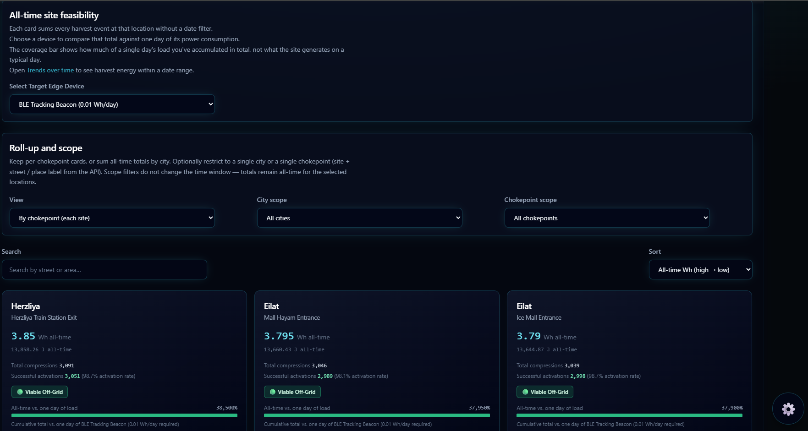
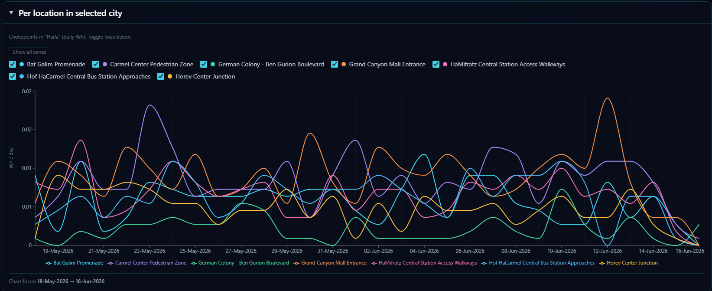
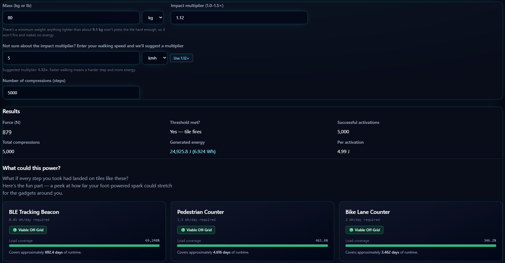
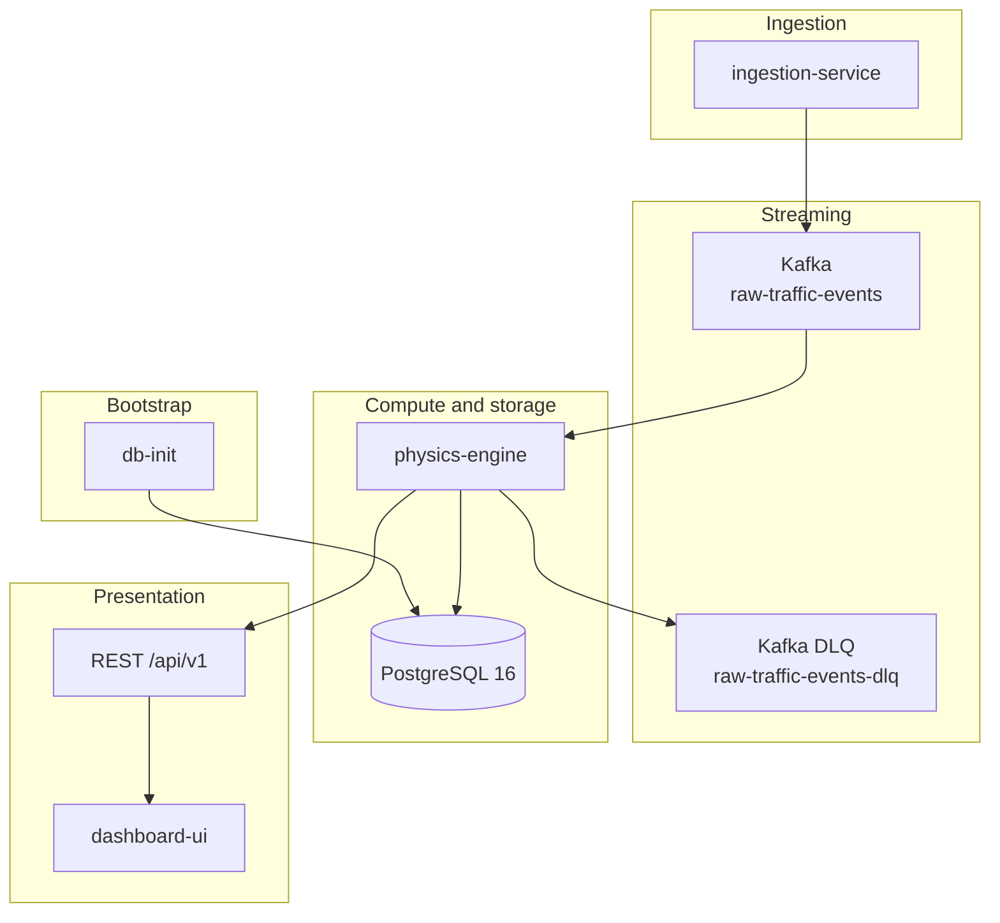

# Project Kinetile

**A feasibility engine for localized piezoelectric micro-generation** at pedestrian and light-mobility chokepoints.

> Portfolio demonstration of event-driven architecture: Python ingestion, Kafka streaming, a Spring Boot physics engine, PostgreSQL persistence, and a React dashboard. Energy figures are **feasibility estimates** aligned with commercial kinetic walkway tiles—not certified field measurements.

---

## Why this project exists

I created Project Kinetile because I believe green energy is something the world needs and that everyone can benefit from.

This project is my way of exploring what can realistically be done at a local scale using piezoelectric energy harvesting in places where people are already moving every day.

The goal is practical and honest: not to claim city-scale power generation, but to test whether this kind of micro-generation could support useful devices such as LED safety markers, environmental sensors, and smart signage.

I am passionate about building technology that can help make the world cleaner and greener, and Kinetile is a concrete step in that direction.

---

## Screenshots

### All-time feasibility

<p align="center">
  
</p>

All-time feasibility by location — an illustrative comparison of harvested energy vs edge-device loads to demonstrate symbolic vs off-grid potential.

### Trends over time

<p align="center">
  
</p>

Daily energy trends — time-series charts of total harvest and breakdowns by city and location.

### Step energy calculator

<p align="center">
  
</p>

Step energy calculator — interactive what-if tool using the same physics constants as the backend.

---

## What it does

Kinetile currently focuses on ingesting, transforming, and visualizing footfall and light-mobility data from busy chokepoints to demonstrate how piezoelectric micro-generation potential can be modeled for **localized, off-grid micro-infrastructure** (IoT sensors, LED markers, e-ink signage, environmental monitors, and similar low-power devices). It is a technical exploration and foundation for stronger decision-support insights in a future version.

The physics model is intentionally honest and vendor-style:

- **Activation threshold:** downward force `mass × g × impactMultiplier` must meet `activationThresholdNewtons` (default **100 N**); otherwise **0 J**.
- **Rated output band:** on activation, joules scale linearly with effective load from **minRatedOutputJoules** (default **2 J**) to **maxRatedOutputJoules** (default **5 J** at 90 kg+).
- **Impact multiplier (1.0–1.5×):** models walking gait intensity; affects both threshold and harvest scaling.
- **Non-goals:** no separate mechanical-to-electrical efficiency factor in harvest math; heavy vehicles are out of scope.

For deeper architecture principles and AI-assistant context, see [AGENTS.md](AGENTS.md).

---

## Features

### Dashboard views

| View | Description |
|------|-------------|
| **All-time feasibility** | Illustrative location-level comparison vs edge-device daily loads |
| **Activation statistics** | Compression and activation summaries |
| **Trends over time** | Daily energy time-series (total, by city, by location) |
| **Compression ledger** | Paginated, filterable event history |
| **Tile inventory** | Infrastructure catalog: cities → chokepoints → tiles |

### More in the app

| Page | Description |
|------|-------------|
| **Step energy calculator** | Interactive what-if tool; formulas stay in sync with the backend via `/api/v1/config/hardware` |
| **About** | Mission statement and honest framing |

Seeded demo geography includes cities such as **Tel Aviv-Yafo** with real UUID-backed tile instances (see [db-init catalog](db-init/src/main/resources/data/infrastructure-registry.json)).

---

## Architecture



**Data flow:** `ingestion-service` (Python) emits synthetic compression events → Kafka buffers the stream → `physics-engine` (Java / Spring Boot) runs the physics model and persists results → REST `/api/v1` serves aggregates → `dashboard-ui` (React) visualizes feasibility. Catalog bootstrap is owned by `db-init` (Flyway + seed).

**Database initialization (`db-init`):**

- Owns **Flyway migrations** and **catalog bootstrap** from `infrastructure-registry.json`.
- Runs automatically on `docker compose up` (full stack and infra-only compose); exits on success.
- Safe to re-run: Flyway no-ops on existing schema; bootstrap skips when the catalog is populated unless `DB_INIT_FORCE=true`.
- **`physics-engine`** uses `ddl-auto: validate` only—no migrations or seeding on startup.
- **Firehose** loads active `tile_id` values from PostgreSQL after `db-init`; it never mints UUIDs.

**Kafka topics:**

| Topic | Purpose |
|-------|---------|
| `raw-traffic-events` | Primary ingestion stream (2 partitions in Compose) |
| `raw-traffic-events-dlq` | Dead-letter queue for invalid or failed payloads (full stack) |

**First-time note:** A fresh database shows empty dashboards until ingestion runs and the physics engine processes events (typically a few minutes after `docker compose up`).

---

## Technical stack

| Layer | Technology |
|--------|------------|
| Physics / API | Java 21, Spring Boot 3.x |
| DB bootstrap | `db-init` module (Flyway + catalog seed) |
| Streaming | Apache Kafka 4.x, KRaft |
| Ingestion | Python 3.12+ (Poetry) |
| Database | PostgreSQL 16 |
| Dashboard | React 19, TypeScript, Vite 8, Tailwind CSS 4 |

---

## Repository layout

```
Project Kinetile/
├── pom.xml                     # Maven parent (db-init + physics-engine)
├── docker-compose.yml          # Full stack
├── docker-compose.infra.yml    # Kafka + Postgres + topic/db bootstrap only
├── .env.example                # Copy to .env for Compose and local defaults
├── db-init/                    # Flyway migrations + infrastructure catalog bootstrap
├── physics-engine/             # Spring Boot Kafka consumer, REST API, and PostgreSQL persistence
├── ingestion-service/          # Python firehose → Kafka
├── dashboard-ui/               # Vite dev server / production nginx build
├── docs/screenshots/
└── AGENTS.md                   # Project brief and coding rules for AI assistants
```

---

## Prerequisites

- **Docker** and **Docker Compose** (Kafka, Postgres, or full stack)
- **Java 21** and **Maven** (local physics engine)
- **Node.js 20+** (local dashboard; Docker build uses Node 22)
- **Python 3.12+** and **Poetry** (local ingestion)

---

## How to run

Choose **full containers** or **infra in Docker + apps on the host**.

### Option A — Full stack (everything in Docker)

From the repository root:

```bash
cp .env.example .env   # optional; adjust ports and secrets
docker compose up --build
```

Wait for one-shot init containers to finish (`kafka-init`, `kafka-init-dlq`, `db-init`), then open the dashboard.

| Service | URL / port |
|---------|------------|
| **Dashboard** (nginx) | `http://localhost:${DASHBOARD_HOST_PORT:-8080}` |
| **Physics engine API** | Not published to the host; proxied at `/api/v1/` through the dashboard container |
| **Kafka** | `localhost:9092` (host); `kafka:29092` inside Compose |
| **PostgreSQL** | `localhost:${POSTGRES_HOST_PORT:-15432}` → `5432` in container |

**Ingestion:** `ingestion-1` and `ingestion-2` run for `INGESTION_MAX_DURATION_SECONDS` (default **1200** s ≈ 20 minutes), then exit (`restart: "no"`).

Stop:

```bash
docker compose down
```

### Option B — Local development (Kafka + Postgres in Docker only)

1. **Start infrastructure** (creates Kafka topics and runs `db-init`):

   ```bash
   docker compose -f docker-compose.infra.yml up -d --build
   ```

   Confirm `projectkinetile-db-init` exited successfully before starting the engine or firehose.

2. **Physics engine** (from repo root):

   ```bash
   mvn -pl physics-engine spring-boot:run
   ```

   Defaults in [physics-engine/src/main/resources/application.yml](physics-engine/src/main/resources/application.yml):

   - Postgres at `localhost:15432`
   - Kafka at `localhost:9092`
   - API at `http://localhost:8080`

   Override when needed (PowerShell: `$env:VAR=value`):

   ```bash
   set SPRING_KAFKA_BOOTSTRAP_SERVERS=localhost:9092
   mvn -pl physics-engine spring-boot:run
   ```

3. **Dashboard** (Vite dev server with API proxy):

   ```bash
   cd dashboard-ui
   npm install
   npm run dev
   ```

   Dev server: `http://localhost:3000` — `/api` is proxied to `http://localhost:8080`.

   To point at another backend:

   ```bash
   set VITE_DEV_PHYSICS_PROXY_TARGET=http://localhost:8080
   npm run dev
   ```

4. **Ingestion** (optional; requires `db-init` catalog and Postgres credentials):

   ```bash
   cd ingestion-service
   poetry install
   cp .env.example .env   # optional
   set KAFKA_BOOTSTRAP_SERVERS=localhost:9092
   poetry run ingestion-firehose
   ```

Shut down infra:

```bash
docker compose -f docker-compose.infra.yml down
```

**Compose volume note:** Full stack and infra compose share the project name `projectkinetile` and the `postgres_data` volume. Do not run two Postgres containers on the same host port—stop one stack before starting the other (or use different ports in `.env`).

---

## Environment variables

See [.env.example](.env.example) for documented variables.

| Variable | Purpose |
|----------|---------|
| `POSTGRES_HOST_PORT` | Host port for Postgres in Docker (default `15432`) |
| `POSTGRES_DB`, `POSTGRES_USER`, `POSTGRES_PASSWORD` | Database identity (must match Spring datasource) |
| `DASHBOARD_HOST_PORT` | Published port for the full-stack dashboard container |
| `DB_INIT_FORCE` | Set `true` to truncate and re-seed catalog (destructive) |
| `INGESTION_MAX_DURATION_SECONDS` | Firehose wall-clock limit (default `1200`; non-positive = unlimited) |
| `INGESTION_BATCH_MIN`, `INGESTION_BATCH_MAX` | Events per burst (defaults `200` / `500`) |
| `INGESTION_BURST_SLEEP_MIN_SECONDS`, `INGESTION_BURST_SLEEP_MAX_SECONDS` | Pause between bursts (defaults `1.0` / `2.0`) |
| `KAFKA_BOOTSTRAP_SERVERS` | Host Python ingestion (`localhost:9092` with infra compose) |
| `VITE_DEV_PHYSICS_PROXY_TARGET` | Backend URL for Vite dev proxy |

Spring Boot does **not** load `.env` automatically; export vars in your shell or IDE when running the engine locally.

Optional Spring overrides (commented in `.env.example`): `APP_CORS_ALLOWED_ORIGINS`, `APP_RATE_LIMIT_ENABLED`, `APP_RATE_LIMIT_RPM`, Kafka topic names.

---

## REST API overview

Base path: `/api/v1`. Open in development (no authentication); rate-limited in production Docker profile.

| Prefix | Endpoints |
|--------|-----------|
| `/api/v1/energy` | `ping`, `summary`, `locations`, `ledger`, `timeseries/daily/*` |
| `/api/v1/infrastructure` | `place-types`, `manufacturers`, `cities`, chokepoints, tiles, `tiles/stale` |
| `/api/v1/config/hardware` | Shared tile physics constants (threshold, joule band) |
| `/api/v1/devices` | Edge-device catalog for uptime framing |

Health: `/actuator/health` (engine only; not proxied through dashboard nginx).

---

## Security notes

This is a **local/portfolio** deployment, not a hardened production SaaS:

- REST API has **no authentication** in dev; abuse is bounded by validation, CORS, and optional per-IP rate limiting.
- Invalid Kafka payloads can be routed to the **DLQ** topic.
- API error responses do not expose stack traces.
- Default credentials in `.env.example` are for local use only—change them before any shared deployment.

---

## Tests

```bash
# Java (db-init + physics-engine modules)
mvn test

# Dashboard (Vitest)
cd dashboard-ui && npm run test

# Ingestion (pytest)
cd ingestion-service && poetry run pytest
```

---

## Module documentation

- [physics-engine/README.md](physics-engine/README.md) — Kafka consumer, physics model, REST API, PostgreSQL persistence
- [ingestion-service/README.md](ingestion-service/README.md) — Synthetic firehose CLI (Kafka producer)
- [dashboard-ui/README.md](dashboard-ui/README.md) — React dashboard (Vite dev server and production build)

---

## License

MIT License — see [LICENSE](LICENSE).

*This repository is a technical portfolio piece demonstrating event-driven architecture, realistic feasibility modeling, Spring Boot backend engineering, and React frontend development.*
